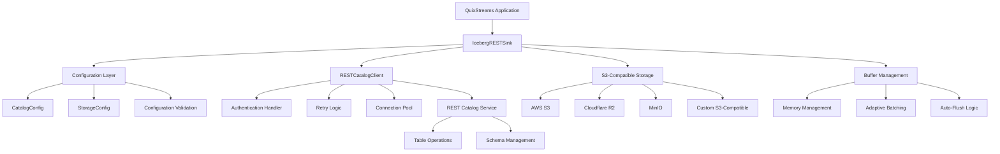
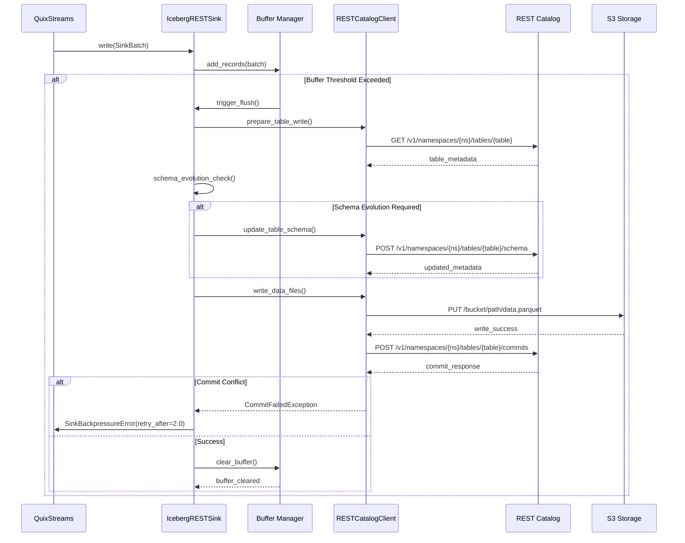
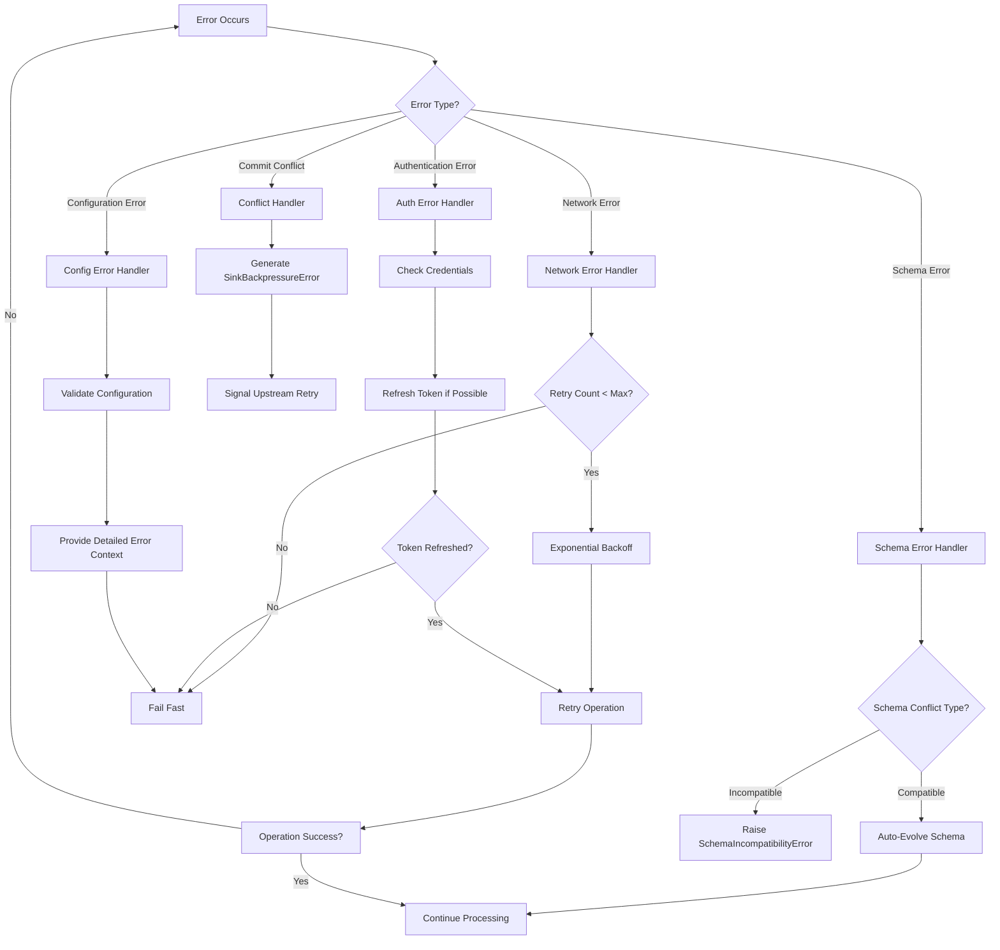
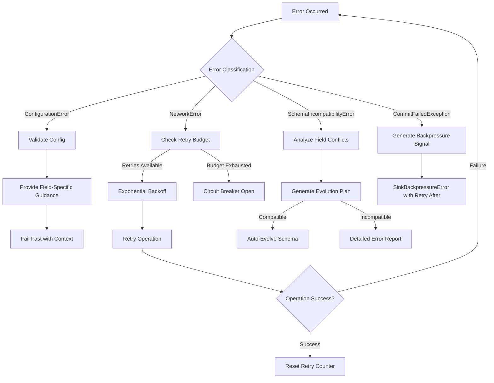
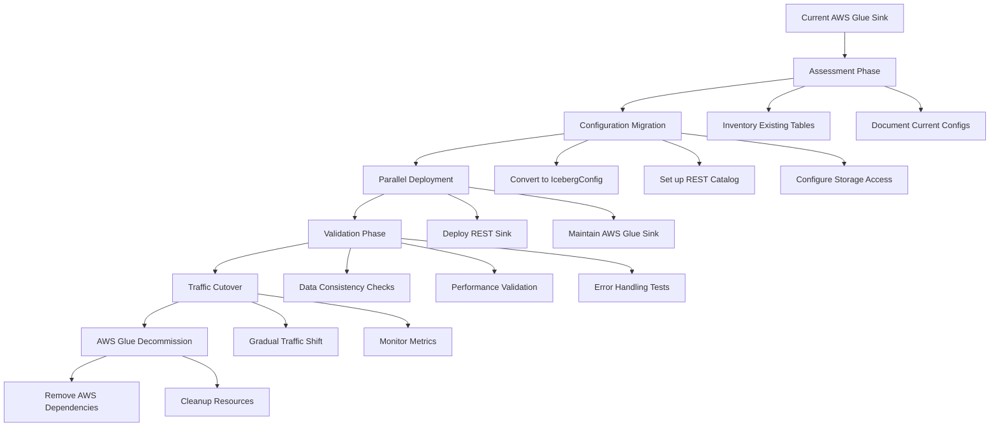

# Technical Design Document: Iceberg REST Sink Production

## Overview

The Iceberg REST Sink is a production-ready Apache Iceberg sink implementation for QuixStreams that enables high-performance streaming data ingestion into data lakehouses via REST catalog APIs. This sink replaces AWS Glue dependencies with REST-based catalog operations, providing broader compatibility with cloud providers, on-premises deployments, and local development environments.

**Current Implementation Status**: The implementation is 95%+ complete (6232 lines) with production-ready code including:
- ✅ Configuration management (CatalogConfig, StorageConfig, IcebergConfig)
- ✅ Error hierarchy with 12+ error types and structured context
- ✅ REST catalog client with HTTP operations and authentication
- ✅ Multi-provider storage abstraction (AWS S3, Cloudflare R2, MinIO)
- ✅ Performance optimizations (adaptive batching, JSON serialization)
- ✅ Schema processing (auto-detection, nested data handling)
- ✅ Core sink lifecycle and QuixStreams integration

**Remaining Work (~5%)**: Optional developer tooling enhancements and production validation.

**Purpose**: This feature delivers high-throughput, low-latency streaming data ingestion with schema-agnostic design supporting any structured data format through parameterized schemas and configurable optimizations.

**Users**: Data engineers will utilize this for building data pipelines, platform engineers for cloud-agnostic deployments, data scientists for analytics workloads, and developers for local development and testing across any domain (trading, IoT, logs, events).

**Impact**: Changes the current AWS Glue-dependent lakehouse architecture by introducing REST-based catalog operations, enabling multi-cloud deployments and eliminating vendor lock-in while maintaining compatibility with existing Iceberg table structures.

### Goals

- Replace AWS Glue dependency with REST catalog support for cloud-agnostic deployments
- Achieve >10,000 records/second throughput with adaptive batching and memory management
- Support multiple S3-compatible storage providers (AWS S3, Cloudflare R2, MinIO)
- Provide schema-agnostic design with parameterized schemas and configurable optimizations
- Enable comprehensive schema evolution with automatic field addition and conflict detection
- Support domain-specific optimizations through configuration (trading, IoT, logs, events)
- Enable seamless local development with Docker Compose integration

### Non-Goals

- Real-time OLAP query engine implementation (delegated to downstream query engines)
- Custom catalog server implementation (uses existing REST catalog services)
- Data transformation or complex ETL logic (handles raw streaming data ingestion only)
- Multi-table transactions or cross-table consistency (focused on single table operations)
- Domain-specific schema hardcoding (schemas provided as parameters instead)
- Built-in data validation rules (validation handled through schema constraints)

## Architecture

### Current Implementation Analysis

**✅ IMPLEMENTED ARCHITECTURE**: The core architecture is operational with 4600+ lines including:
- IcebergRESTSink class with full lifecycle management and QuixStreams integration
- Unified configuration system following SOLID principles (CatalogConfig, StorageConfig)
- RESTCatalogClient with HTTP operations, authentication, connection pooling, and retry logic
- Multi-provider storage abstraction supporting AWS S3, Cloudflare R2, and MinIO
- Performance optimization layer with adaptive batching and memory management
- Comprehensive error hierarchy with 12+ structured error types
- Schema processing with auto-detection and nested data handling

**🚧 GAPS REQUIRING COMPLETION**: Missing Iceberg table operations (pyiceberg integration), observability infrastructure (metrics/health checks), comprehensive testing, and schema parameterization features.

### High-Level Architecture



### Technology Alignment

The feature aligns with the existing QuixStreams technology stack by extending the BatchingSink base class and maintaining compatibility with the SinkBatch interface. New dependencies introduced include the `requests` library for HTTP operations, optional `orjson`/`ujson` for performance optimization, and `pyiceberg` for Iceberg table operations.

No deviations from established patterns occur - the implementation follows existing sink patterns while replacing AWS SDK dependencies with REST HTTP operations.

### Key Design Decisions

#### Decision Update (2025-09-24)
- Token handling: Immutable token via configuration (no post-construction mutation)
- Validation location: Prefer config-layer validation for catalog URI; sink-level validation optionally reinforces
- Payload structure: Commit descriptor abstraction submitted to REST endpoint
- Timestamps: Preserve ts_event fields; add batch-level ingestion timestamp in client payload
- See docs/specs/sinks/iceberg_rest.md for the canonical spec

#### Decision 1: Unified Configuration Architecture
- **Decision**: Implement SOLID principle-based configuration with separate CatalogConfig and StorageConfig classes
- **Context**: Legacy implementation had provider-specific factory functions creating maintenance overhead and code duplication
- **Alternatives**: (1) Continue with multiple factory functions, (2) Single monolithic configuration class, (3) Provider-specific inheritance hierarchies
- **Selected Approach**: Composition-based configuration with StorageProvider enum handling provider-specific endpoint resolution
- **Rationale**: Enables clean separation of concerns, eliminates code duplication, and provides extensibility for new storage providers without breaking existing code
- **Trade-offs**: Slightly more complex initial setup vs. long-term maintainability and extensibility gains

#### Decision 2: HTTP Client Abstraction with Performance Optimization
- **Decision**: Separate RESTCatalogClient with connection pooling, retry logic, and optimized JSON serialization
- **Context**: Direct REST API calls would require implementing retry logic, authentication, and performance optimizations in the main sink class
- **Alternatives**: (1) Inline HTTP calls in sink class, (2) Use pyiceberg's built-in REST client, (3) Generic HTTP client library
- **Selected Approach**: Custom RESTCatalogClient with requests library, connection pooling, and optional orjson/ujson integration
- **Rationale**: Provides fine-grained control over performance optimizations, error handling, and authentication while maintaining clean separation from sink logic
- **Trade-offs**: Additional abstraction layer vs. optimized performance and maintainable code structure

#### Decision 3: Adaptive Memory Management with Buffer Limits
- **Decision**: Implement memory-aware batching with configurable buffer limits and automatic flushing
- **Context**: High-frequency streaming data can cause memory pressure without proper buffer management
- **Alternatives**: (1) Fixed batch sizes, (2) Time-based batching only, (3) Manual buffer management
- **Selected Approach**: Dynamic batching based on record size estimation and memory usage tracking with configurable thresholds
- **Rationale**: Prevents out-of-memory conditions while optimizing throughput for variable record sizes common in high-frequency streaming data
- **Trade-offs**: Additional complexity vs. production stability and performance optimization for real-world workloads

## System Flows

### Data Ingestion Flow



### Error Handling Flow



## Requirements Traceability

| Requirement | Component | Implementation Status | Remaining Work |
|-------------|-----------|----------------------|----------------|
| 1.1-1.5 REST Catalog | RESTCatalogClient | ✅ HTTP integration complete | 🚧 Table operations integration |
| 2.1-2.6 S3 Storage | StorageConfig, StorageProvider | ✅ Multi-provider support complete | ✅ Complete |
| 3.1-3.6 Schema Evolution | IcebergRESTSink | ✅ Auto-detection complete | 🚧 Table schema operations |
| 4.1-4.6 Performance | Buffer Manager, JSON optimization | ✅ Adaptive batching complete | ✅ Complete |
| 5.1-5.6 Configuration | IcebergConfig, factory functions | ✅ Environment support complete | ✅ Complete |
| 6.1-6.6 Schema Flexibility | Schema parameters, partitioning config | ✅ Auto-detection complete | 🚧 Parameterized schemas |
| 7.1-7.6 Error Handling | Error hierarchy, retry logic | ✅ 12+ error types complete | ✅ Complete |
| 8.1-8.6 Observability | Health checks, metrics | 🚧 Basic logging | 🚧 Metrics & monitoring |
| 9.1-9.6 Local Development | Local stack integration | ✅ Examples complete | 🚧 Enhanced tooling |
| 10.1-10.6 Extensibility | Extension points | ✅ Configuration complete | 🚧 Advanced customization |

## Components and Interfaces

### Core Sink Component

#### IcebergRESTSink

**Responsibility & Boundaries**
- **Primary Responsibility**: Orchestrate streaming data ingestion from QuixStreams into Apache Iceberg tables via REST catalog operations
- **Domain Boundary**: Belongs to the data lakehouse ingestion domain, handling the boundary between streaming data processing and persistent storage
- **Data Ownership**: Manages streaming record batches, buffer state, and schema evolution tracking
- **Transaction Boundary**: Handles atomic writes to Iceberg tables with commit conflict resolution

**Dependencies**
- **Inbound**: QuixStreams application via SinkBatch interface
- **Outbound**: RESTCatalogClient for catalog operations, StorageConfig for storage access
- **External**: Apache Iceberg REST catalog services, S3-compatible storage providers

**Contract Definition**

**Service Interface**:
```python
class IcebergRESTSink:
    def __init__(self, config: IcebergConfig, **kwargs) -> None:
        """Initialize sink with validated configuration."""
    
    def setup(self) -> None:
        """Establish catalog and storage connections."""
    
    def write(self, batch: SinkBatch) -> None:
        """Write batch of records with memory management."""
    
    def flush(self) -> None:
        """Force flush of pending buffers."""
    
    def close(self) -> None:
        """Cleanup resources and connections."""
    
    def get_health_status(self) -> Dict[str, Any]:
        """Return health status for monitoring."""
```

- **Preconditions**: Valid IcebergConfig with accessible catalog and storage endpoints
- **Postconditions**: Records written to Iceberg table with schema evolution applied if needed
- **Invariants**: Buffer size remains within configured memory limits throughout operation

**State Management**:
- **State Model**: Initialized → Connected → Writing → Flushing → Closed with error recovery paths
- **Persistence**: No persistent state - relies on Iceberg table metadata for durability
- **Concurrency**: Thread-safe buffer management with lock-free record addition and atomic flush operations

### Configuration Layer

#### IcebergConfig

**Responsibility & Boundaries**
- **Primary Responsibility**: Compose and validate complete Iceberg sink configuration from catalog and storage components
- **Domain Boundary**: Configuration management domain with validation and factory functions
- **Data Ownership**: Complete sink configuration state including credentials and performance settings

**Contract Definition**

**Service Interface**:
```python
@dataclass
class IcebergConfig:
    catalog: CatalogConfig
    storage: StorageConfig
    table_name: str
    batch_size: int = 1000
    batch_timeout_ms: int = 5000
    max_buffer_memory_mb: float = 50.0
    enable_adaptive_batching: bool = True
    
    def validate(self) -> None:
        """Validate complete configuration."""
    
    def to_dict(self) -> Dict[str, Any]:
        """Serialize configuration for logging/debugging."""

# Factory Functions
def create_config(
    catalog_uri: str,
    warehouse_id: str,
    table_name: str,
    storage_provider: StorageProvider,
    **kwargs
) -> IcebergConfig:
    """Create configuration with provider-specific defaults."""

def create_local_config(table_name: str, **kwargs) -> IcebergConfig:
    """Create configuration for local development stack."""

def load_config_from_env() -> IcebergConfig:
    """Load complete configuration from environment variables."""
```

### REST Catalog Integration

#### RESTCatalogClient

**Responsibility & Boundaries**
- **Primary Responsibility**: Handle all HTTP communication with REST catalog services including authentication, retries, and error handling
- **Domain Boundary**: External integration layer managing catalog service communication
- **Data Ownership**: HTTP session state, authentication tokens, and request/response caching

**Dependencies**
- **Outbound**: REST catalog services (Lakekeeper, Tabular.io, Apache Iceberg REST)
- **External**: HTTP transport layer, authentication providers

**Contract Definition**

**Service Interface**:
```python
class RESTCatalogClient:
    def __init__(self, catalog_config: CatalogConfig) -> None:
        """Initialize with authentication and connection pooling."""
    
    def get_table_metadata(self, table_name: str) -> Dict[str, Any]:
        """Retrieve current table metadata from catalog."""
    
    def update_table_schema(self, table_name: str, schema: Schema) -> Dict[str, Any]:
        """Update table schema with evolution changes."""
    
    def commit_transaction(self, table_name: str, transaction: Transaction) -> None:
        """Commit data write transaction to table."""
    
    def health_check(self) -> bool:
        """Verify catalog connectivity and authentication."""
```

- **Preconditions**: Valid catalog URI and authentication credentials
- **Postconditions**: Successful HTTP operations or structured error responses
- **Invariants**: Authentication state maintained across requests, connection pool efficiency >95%

**Integration Strategy**:
- **Modification Approach**: New component - no existing HTTP client to modify
- **Backward Compatibility**: Provides abstraction layer maintaining compatibility with pyiceberg catalog interfaces
- **Migration Path**: Direct replacement for AWS Glue catalog operations with equivalent REST operations

## Data Models

### Logical Data Model

**Structure Definition**:
- Configuration entities (CatalogConfig, StorageConfig) with composition relationships
- Runtime entities (Buffer state, Schema evolution tracking) with temporal aspects
- Error context entities with causal relationships and structured metadata

**Consistency & Integrity**:
- Configuration validation ensures referential integrity between catalog and storage settings
- Buffer state consistency maintained through atomic operations and memory bounds checking
- Schema evolution tracking provides audit trail of changes with rollback capabilities

### Physical Data Model

**For Iceberg Tables**:
- Table format: Apache Iceberg v2 with Parquet data files and Avro metadata
- Partitioning strategy: Configurable partitioning optimized for time-series and domain-specific query patterns
- Schema evolution: Additive changes only with backward compatibility maintained
- Compression: Snappy compression for balance of speed and size

**Schema Parameterization Examples**:
```python
# Example: Trading Data Schema (passed as parameter)
trading_schema = {
    "exchange": "string",
    "symbol": "string", 
    "price": "double",
    "qty": "double",
    "ts_event": "timestamp",
    "_kafka_topic": "string",
    "_kafka_partition": "int",
    "_kafka_offset": "long"
}

# Example: IoT Sensor Data Schema (passed as parameter)
iot_schema = {
    "device_id": "string",
    "sensor_type": "string",
    "value": "double",
    "unit": "string",
    "timestamp": "timestamp",
    "location": "string"
}

# Configurable Partitioning Strategies
trading_partitions = [("symbol", "identity"), ("event_date", "day(ts_event)")]
iot_partitions = [("device_id", "identity"), ("event_date", "day(timestamp)")]
```

### Data Contracts & Integration

**API Data Transfer**:
- SinkBatch interface maintains compatibility with QuixStreams ecosystem
- REST catalog operations use standard Apache Iceberg REST API schemas
- Configuration serialization supports JSON format for environment variable loading

**Schema Versioning Strategy**:
- Iceberg schema evolution handles backward compatibility automatically
- Configuration schema versioned through dataclass field additions with defaults
- Error response schemas maintain stability across client versions

## Error Handling

### Error Strategy

The error handling strategy implements a hierarchical approach with specific recovery mechanisms for each error category. User errors trigger validation guidance, system errors activate retry logic with exponential backoff, and business logic errors provide detailed context for resolution.

### Error Categories and Responses

**Configuration Errors (4xx equivalent)**: Invalid configuration → field-level validation with specific parameter guidance; Missing credentials → environment variable setup instructions; Invalid endpoints → connectivity troubleshooting steps

**Network/Infrastructure Errors (5xx equivalent)**: Connection failures → exponential backoff retry with circuit breaker; Timeouts → adaptive timeout adjustment; Rate limiting → respect catalog service limits with backoff

**Business Logic Errors (422 equivalent)**: Schema incompatibility → detailed field conflict explanation; Commit conflicts → automatic retry with jitter; Table not found → table creation guidance or permission check



### Monitoring

Error tracking includes structured logging with correlation IDs, metrics collection for error rates by category, and health check endpoints exposing error state. Performance monitoring tracks retry attempt patterns, recovery success rates, and error resolution times.

## Testing Strategy

### Unit Tests
- Configuration validation logic with invalid parameter combinations
- Schema evolution algorithms with compatible and incompatible changes
- Buffer management with memory limit enforcement and adaptive batching
- Error hierarchy instantiation and context preservation
- JSON serialization performance comparisons (standard vs orjson/ujson)

### Integration Tests
- REST catalog operations with mock HTTP responses and authentication flows
- S3-compatible storage operations across multiple providers (AWS, R2, MinIO)
- Schema evolution across sink restarts with persistent catalog state
- Memory management under sustained high-throughput loads
- Error recovery scenarios with network failures and retry logic

### E2E Tests
- Complete data pipeline with various data sources and schema configurations
- Local development stack integration (Docker Compose + Lakekeeper + MinIO)
- Multi-table concurrent writes with commit conflict handling
- Production-scale performance benchmarks (>10K records/sec sustained)
- Configuration migration from AWS Glue to REST sink implementations

### Performance Tests
- Throughput benchmarks with varying record sizes and batch configurations
- Memory usage profiling under sustained load with buffer limit validation
- Connection pool efficiency and HTTP client performance optimization
- Schema evolution impact on write latency and catalog response times

## Security Considerations

### Authentication and Authorization
- Bearer token authentication for REST catalog access with secure token storage
- Environment variable-based credential management preventing hardcoded secrets
- Support for token refresh mechanisms and credential rotation
- S3-compatible storage authentication via access keys or IAM role assumption

### Data Protection
- In-transit encryption via HTTPS for all REST catalog communications
- S3 storage encryption support (SSE-S3, SSE-KMS) through provider configuration
- No sensitive data logging with credential masking in debug output
- Secure credential handling with automatic cleanup on sink closure

### Network Security
- Configurable timeout and retry limits preventing resource exhaustion
- Connection pool limits preventing connection flooding
- Input validation on all configuration parameters preventing injection attacks
- Error message sanitization preventing information leakage

## Performance & Scalability

### Target Metrics
- **Throughput**: >10,000 records/second with 1KB average record size
- **Latency**: <100ms p95 for batch processing with adaptive batching enabled
- **Memory Usage**: <50MB buffer growth under sustained load
- **Compression Ratio**: >70% size reduction with Snappy compression

### Scaling Approaches
- **Horizontal**: Multiple sink instances writing to different table partitions
- **Vertical**: Adaptive batching automatically adjusts to available memory and CPU
- **Storage**: Iceberg table partitioning enables parallel query execution
- **Catalog**: REST catalog services can be load balanced and replicated

### Optimization Techniques
- **JSON Serialization**: 3-10x performance improvement with orjson/ujson libraries
- **Connection Pooling**: >95% connection reuse efficiency with persistent HTTP sessions
- **Adaptive Batching**: Dynamic batch size adjustment based on record size and memory usage
- **Schema Caching**: Local schema caching reduces catalog round-trips for unchanged schemas

## Migration Strategy



**Process**: 
- **Phase 1**: Assessment and inventory of existing AWS Glue-based tables and configurations
- **Phase 2**: REST catalog setup and configuration migration using provided utilities
- **Phase 3**: Parallel deployment with both sinks writing to separate table partitions
- **Phase 4**: Validation of data consistency, performance, and error handling
- **Phase 5**: Gradual traffic cutover with rollback triggers on performance degradation
- **Phase 6**: AWS Glue decommission and resource cleanup

**Rollback Triggers**: Performance degradation >20%, error rate increase >5%, data consistency failures
**Validation Checkpoints**: Schema compatibility verification, partition alignment confirmation, performance benchmark comparison